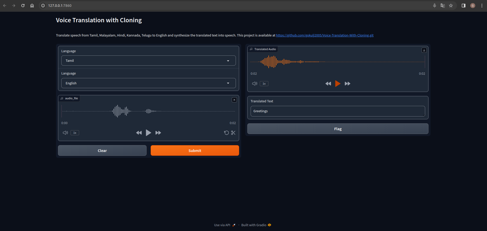

### Voice Translation With Cloning

This project aims to translate user-spoken audio from various languages into English using the same voice as the original speaker. It incorporates OpenAI's Whisper model to convert audio into translated text and utilizes Real-Time Voice Cloning for voice replication.

**Note**: This project works with Python 3.8.1.

#### Getting Started

1. **Clone the Repository:**
   ```bash
   git clone https://github.com/gokulj2005/Voice-Translation-With-Cloning.git
   cd Voice-Translation-With-Cloning
   ```

2. **Create a Virtual Environment with python 3.8.1:**
   Example:
   ```bash
   conda create --name env python=3.8.1
   ```
   Refer [Anaconda](https://www.anaconda.com/download) for installation of Conda

   **Activate the Environment with:**
   ```bash
   conda activate env
   ```

4. **Install Requirements:**
   ```bash
   pip install -r requirements.txt
   ```

5. **Install ffmpeg:**
   Ensure that ffmpeg is installed on your system using one of the following methods:
   - Ubuntu or Debian:
     ```bash
     sudo apt update && sudo apt install ffmpeg
     ```
   - Arch Linux:
     ```bash
     sudo pacman -S ffmpeg
     ```
   - MacOS using Homebrew:
     ```bash
     brew install ffmpeg
     ```
   - Windows using Chocolatey:
     ```bash
     choco install ffmpeg
     ```
   - Windows using Scoop:
     ```bash
     scoop install ffmpeg
     ```

6. **Download Cloning Models:**
   Download the following files and save them in the specified directory within the cloned repository:
   - [encoder.pt](https://drive.google.com/file/d/1q8mEGwCkFy23KZsinbuvdKAQLqNKbYf1/view) (save in `saved_models/default/encoder.pt`)
   - [synthesizer.pt](https://drive.google.com/file/d/1EqFMIbvxffxtjiVrtykroF6_mUh-5Z3s/view) (save in `saved_models/default/synthesizer.pt`)
   - [vocoder.pt](https://drive.google.com/file/d/1cf2NO6FtI0jDuy8AV3Xgn6leO6dHjIgu/view) (save in `saved_models/default/vocoder.pt`)

7. **Run the Application:**
   ```bash
   python main.py
   ```
#### Sample Output Screenshot



In the above output, the input audio wzs recorded in Tamil and output is got with English


#### Usage

- This project currently supports Indian regional languages. To add more languages, check available options using:
  ```bash
  whisper -h
  ```

- By default, the project uses the "whisper small" model. Modify the `model` variable in `main.py` to change the model.

#### Shoutout
Huge shoutout to the owner of this repository [Whisper](https://github.com/openai/whisper.git) which enabled me to do the translation part and thr owner of this repository [Real-Time Voice Cloning](https://github.com/CorentinJ/Real-Time-Voice-Cloning.git), which enabled me to implement the voice cloning part.

#### Contact Information
For inquiries or assistance, please contact me at gokulj@karunya.edu.in.

#### License

This project is licensed under the MIT License. If you use this project in your work, kindly acknowledge the source and refer to the repository: [Voice Translation With Cloning](https://github.com/gokulj2005/Voice-Translation-With-Cloning.git).

#### References

- [OpenAI Whisper](https://openai.com/research/whisper)
- [OpenAI Whisper Repository](https://github.com/openai/whisper.git)
- [Real-Time Voice Cloning Repository](https://github.com/CorentinJ/Real-Time-Voice-Cloning.git)
